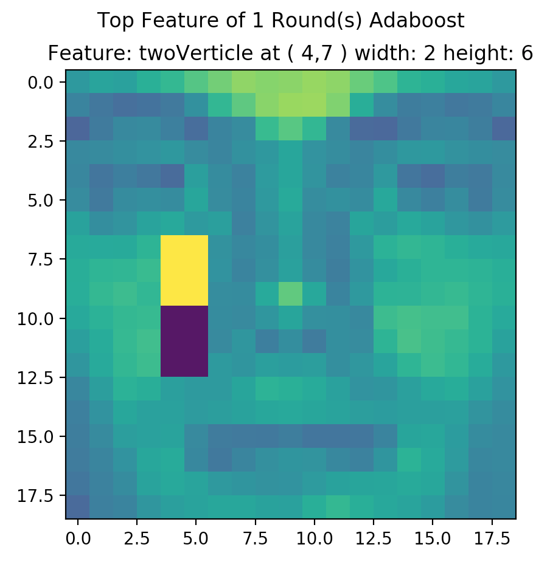

# Viola-Jones Algorithm with Adaboost using Python 3

This is a Python 3 implementation of Viola-Jones Algorithm, please follow the instructions below to train the detector and using it to detect real photos.

##### Required packages:

- pickle	# Used for saving calculated features, array-ized dataset onto disk.
- opencv # Used for reading and processing image files and convert them into a single array.
- scikit-learn # Used for accelerating the feature selection, you can comment them out in 'ViolaJonesFaceDetector.py' but expect significant slow process on feature selection.
- matplotlib.pyplot # Used for plotting box of features on example photo.

##### How to run the code:

1. Download/clone the entire repository, all training/testing photos are stored in 'dataset' folder, you can change the dataset or using your own version of dataset.

2. If you're using the dataset provided, you should be able to run 'RunTrainerAndTester.py' directly, but check to make sure the dependency of packages are met. You can open the file to change some parameters in

	`TrainDetector(1, 'new', faces_images_count, non_faces_images_count, window_size)`

	1. The first argument is an integer of how many Adaboost rounds you want;
	2. ‘new’ means generating new features, this is to save your time if your dataset is fixed (as features are calculated based on training dataset), so for the first time, using 'new' to generate features, and once the features are generated (saved in the same folder as 'features.pkl', about 500 MB for given dataset), then later on you can using the existed features to calculate different rounds of Adaboost classifiers, or change the parameters.
	3. Don't change the rest of parameters unless you understand the program.

	by default, the maximum window size for Haar's feature is 8 pixels to limit the training process.

3. Once you run the 'RunTrainerAndTester.py' file with all required packages installed, you should see the progress in the console like:

  ```bash
  499 faces images and 2000 non-faces images are loaded and saved in Training-Data.pkl
  Training Started.......
  Building features....
  Total features for 19 x 19 image with window size of 8 is 26168
  Applying features to Training set...
  Calculating features on data # 0 / 2499
  Calculating features on data # 1 / 2499
  Calculating features on data # 2 / 2499
  .........
  Calculating features on data # 2496 / 2499
  Calculating features on data # 2497 / 2499
  Calculating features on data # 2498 / 2499
  Start training weak classifiers
  selecting best classifier out of 2617
  24.99% finished, please wait...
  49.98% finished, please wait...
  .........
  74.97% finished, please wait...
  99.96% finished, please wait...
  -------------Round # 10 -----------------
  Alpha: 1.1e+01
  Feature:  twoVerticle ( 10 , 5 ) Width 2 Height 8
  Training Error: 0.00%
  Training Treshold: -4.0
  Training Accuray: 55.37% ( 526 / 950 )
  Training False Positive: 42.11% ( 400 / 950 )
  Training False Negative: 2.53% ( 24 / 950 )
  ---------------------------------------
  success: Training Done
  ---------------------------------------
  Test dataset loaded
  472 faces images and 475 non-faces images are loaded and saved in Test-Data.pkl
  [(('twoVerticle', 17, 4, 2, 6), -2.0, (769, 950)), (('twoVerticle', 3, 1, 3, 2), -2.0, (541, 950)), (('twoVerticle', 2, 1, 3, 2), -2.0, (404, 950)), (('twoVerticle', 4, 3, 2, 2), 0.0, (649, 950)), (('twoVerticle', 1, 1, 2, 8), -4.0, (530, 950)), (('twoVerticle', 3, 14, 3, 2), -1.0, (517, 950)), (('twoVerticle', 4, 7, 2, 8), 7.0, (480, 950)), (('twoVerticle', 4, 18, 3, 2), -1.0, (581, 950)), (('twoVerticle', 1, 2, 1, 2), -1.0, (481, 950)), (('twoVerticle', 11, 6, 2, 8), -4.0, (526, 950))]
  [5.079995271174973, 5.806817285138741, 8.16708732838109, 8.80540572350739, 6.696829303810116, 10.818388812842256, 7.827263950074671, 11.92781628687352, 10.144053913574604, 10.98478973594049]
  getBoxImage ('twoVerticle', 4, 18, 3, 2)
  ---------------Test Result------------
  Adaboost 10 Round(s)
  Top Feature:  twoVerticle ( 3 , 17 ) Width 3 Height 2
  Top Threshold: -1.0
  Top Training Accuracy: 61.16% ( 581 / 950 )
  Test Accuracy: 66.10% ( 626 / 947 )
  Test False Positive: 4.33% ( 41 / 947 )
  Test False Negative: 29.57% ( 280 / 947 )
  ```

  For the last testing round, you may expected a plot pops up to show you the best feature (having largest alpha)  as:

  

  please close the window to continue print out the test result.


##### How to use real-world photo for face detection:

Run 'RunFaceDetectorOnRealPhoto.py', or change the path yourself by openning the file and change 'testimage'. It may take a while to display the result as below:

```bash
Image testimage.jpg  is loaded
Start recognition...
```


